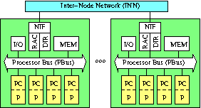
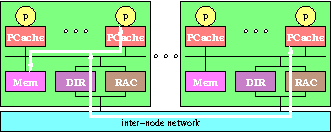
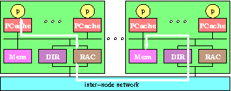

# RACE Protocol: Remote Access Cache Coherency Enforcement Protocol
The **RACE Protocol** is a cache coherency protocol that uses a full-mapped
directory-based cache protocol to provide a consistent memory through
multi-level memory hierarchy consisting of a number of processor caches
(first and second level caches), physically-distributed shared-memory,
and third level caches.
This document describes a background, a general overview of the RACE
protocol, and an implementation utilizing the Intel Standard High
Volume system-boards.
  
All contents are provided as it is WITHOUT ANY WARRANTY and NO TECHNICAL SUPPORT will be provided for problems
that might arise.

### PDLS system: CC-NUMA
The **PDLSystem** (Physically-Distributed but 
Logically-Shared memory system) a kind of CC-NUMA
consists of a number of processing nodes that are interconnected
via an inter-node network as shown in the figure below.
The processing node contains processors with private caches, a memory
module which is a part of globally-shared memory space, an I/O, and
a network interface containing a remote access cache and a directory.

|  |
|:---:|
| *Physically-Distributed but Logically-Shared memory system  Processor (P); Processor Cache (PC); Network Interface (NIF); Directory (DIR); Remote Access Cache (RAC)* |

The processor caches within the processing node are kept coherent
by an invalidation-based snoopy cache coherency protocol.
An access of a location not already in the processor cache generates
a request on the processor bus to fetch the corresponding cache line.
If the location is mapped on the local (near) memory within the processing
node, the memory usually provides the requested data.
Otherwise, the request is handled by the remote access cache; i.e.
the remote access cache provides the data when it contains the data in valid
state, otherwise fetching the data from the remote (far) memory
where the location is mapped through the inter-node network.
Accesses from the outside of the processing node are tracked by the
directory to keep caching (sharing) information.

### The RACE protocol overview
When a processor incurs a cache miss, the request looks up the address
of the memory block that contains the requested cache line, to determine
if the home is local or remote.
If it is local, the local memory would provide the data to the
processor cache (see figure local-access).
Otherwise, the remote access cache would provide
the data to the processor cache (see figure remote-access).

|  |  |
|:---:|:---:|
| *Local access* | *Remote access* |

Although the requested cache line is allocated at the local memory
(i.e. local request),
the directory should be looked up to enforce data coherency
because the remote access caches at the remote nodes may have a copy.
In order for the remote access cache to provide the requested data
(i.e. remote request),
the remote access cache should have the data in proper state.
If not, the remote access cache at the requesting node generates
an inter-node request to the home node.
There, the directory retrieves the block
from its local memory if the home node owns the data.
Otherwise the directory at the home node forwards the request
to owning node and the owning node sends the data to the requesting node
and informs the home node of its completion.
Thereafter, the remote access cache
at the requesting node finally provides the data to the processor cache.

## Background
The RACE protocol is a result of **High-Performance Multi-Media Server Project**: MX-Server
(1998 -- 2000, Funded by Ministry of Information and Communication; joint project with ETRI and Samsung) 
The primary goal of the Project is to develop a state-of-the-art high-performance multimedia server supporting more than 20,000 media streams, store more than 1,000 terabyte of multimedia data, and maintain QoS of HDTV level. From architectural point of view, the MX-Server is a CC-NUMA (Cache Coherent Non-Uniform Memory Access) architecture and processing nodes utilizing up-to 4 Pentium II Xeon processors are connected via dual-SCI (Scalable Coherent Interface: IEEE Std. 1596) rings. My major role was designing a full-map-based directory cache coherency protocol (called RACE -- Remote Access Cache coherency Enforcement) and designing a directory controller ASIC. In addition to this I designed an inter-cache bus utilizing packet transfer protocol (called I-Link bus).

## Historical perspective
Dr. Woo-Jong Hahn, who was the chief of the CC-NUMA hardware group
consisting of the processing node and network teams,
proposed a system architecture in general utilizing the Intel
SHV in February 1998. Dr. Hahn was also served as the leader of
the processing node team and Mr. Sang-Seok Shin became the leader
of the network team.
At that time network option was still unknown.

In March 1998, Dr. Ando Ki was appointed the leader of the small
task group in the processing node team having objectives to design
detailed hardware architecture and cache protocol.
Some time later in March, the name of the processing node team
changed to the CC-Link team and finally in August, it was fixed
as Cache Coherent Agent (CCA) team.
Some day in May, the decision was made to use Scalable Coherent
Interface (SCI: IEEE Std. 1596-1992) as the inter-node network.

As the result of Dr. Ki's single-handed effort the bulk of the text
of the RACE protocol first appeared in April 1998 as the
Version 0.0 Draft.
It was not a whole set of specification since it contained
general protocol based on physically-distributed but
logically-shared (PDLS) system.
Many presentations and discussions were followed
and without these activities this document would not have
been possible. Especially Mr. Sang-Man Moh was actively
providing invaluable ideas and helped shape this document.

After releasing Version 0.0 Draft, many problems came visible
in order to adapt the protocol to combination of the Intel SHV
and SCI (more specifically Dolphin LinkController chip).
The main obstacle was lack of information.
However, Mr. Sang-Seok Shin and Mr. Seong-Woon Kim, who had
background of Intel Pentium processor system and
Mr. Won-Se Sim and Mr. Jong-Seok Han,
who did their best to obtain information of LinkController chip
made it possible to the RACE protocol Version 0.1 in July 1998.

Many problems still remained until the RACE protocol Version 0.2
was released in November 1998.
One particular issue was of locking related and it was solved
with the aid of many people
who are Mr. Jae-Kyung Lee, Mr. Sung-In Jung,
Ms. Sun-Ja Kim, Ms. Jeong-Nyeo Kim, and Mr. Il-Yeon Cho,
in CC-NUMA operating system group led by Mr. Hae-Jin Kim.

### Acknowledgment
The following people are acknowledged, who have contributed
	to the RACE protocol:
	Woo-Jong Hahn (한우종),
	Ando Ki (기안도),
	Seong-Woon Kim (김성운),
	Sang-Man Moh (모상만), and
	Kyu-Hyun Shim (심규현).
 
The contributions of others are also acknowledged:
	Sung-Hun Choi (최성훈),
	Jong-Seok Han (한종석),
	Kyoung Park (박경),
	Sang-Seok Shin (신상석),
	Won-Se Sim (심원세), and
	Chul-Ho Won (원철호).

---
